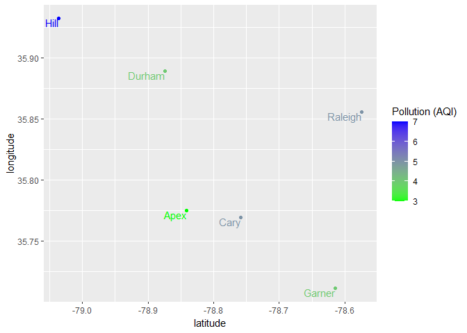
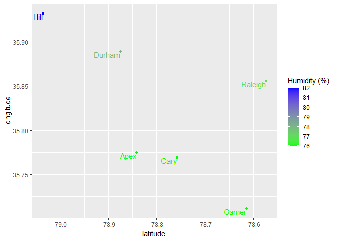

Project2
================
LiChia Chang
2023-10-07


- [Introduction](#introduction)
- [Requirements](#requirements)
- [API Interaction Functions](#api-interaction-functions)
- [Exploratory Data Analysis](#exploratory-data-analysis)
  - [Question: relationships between humidity, pollution, and the
    geographical coordinates of cities in
    NC](#question-relationships-between-humidity-pollution-and-the-geographical-coordinates-of-cities-in-nc)

# Introduction

This document is a vignette to show how to retrieve data from an API. To
showcase this, I will create multiple functions for refining API
endpoints and design helper functions to enhance the user-friendliness
of the API. In the final section, I will employ these functions to
extract data that I’m interested in and conduct exploratory data
analysis.

This article dives into the [AirVisual
API](https://www.iqair.com/commercial-air-quality-monitors/api), which
collects data from the largest network of ground-based sensors
worldwide, providing the most accurate and reliable air quality
information. Further details will be discussed in the subsequent
sections.

# Requirements

To interact with the AirVisual API, you will requrie several libraries.
In the R environment console, you can install these libraries by using
the following command: `install.packages(package_name)`. Make sure to
replace package_name with the name of any library from the list below
that you haven’t installed in your environment.

``` r
library(httr)
library(dplyr)
library(jsonlite)
library(ggplot2)
```

# API Interaction Functions

In this section, I will demonstrate how to establish contact with the
AirVisual API and develop functions for specific purposes. I will
provide separate explanations for each function, detailing their usage
and intended purpose.

*Note: For this project, I am utilizing my own API key, which allows for
up to 10,000 calls per month. If you wish to use your own API key,
simply add your key to “key=”. You can find detailed information
regarding API key usage at this website:
<https://www.iqair.com/dashboard/api>*

- **Get all supported countries** First, this function retrieves a list
  of countries that are supported by the AirVisual API.

``` r
get_country <- function(){
  
  # Define the API URL with the provided API key for retrieving country data
  url <- 'http://api.airvisual.com/v2/countries?key=b94cdf68-3b7b-4808-9012-ffb6359d7690'
  
  # Get api response and content
  response <- GET(url)
  country_list <- content(response, encoding = "UTF-8")$data
  
  # Convert the list of countries to a data frame
  results <- data.frame(country = sapply(country_list, '[[', 'country'))
  return(results)
}
```

- **Verify whether the country is included in the list of supported
  countries** This function serves as a convenient helper, enabling
  users to effortlessly determine if their provided country name is
  supported by AirVisual. The function returns boolean (True/False) for
  verifing if a given country is supported by AirVisual API.

``` r
verify_country <- function(country="USA"){
  
  # Define the API URL with the provided API key for retrieving country data
  url <- 'http://api.airvisual.com/v2/countries?key=b94cdf68-3b7b-4808-9012-ffb6359d7690'
  
  # Get api response and content
  response <- GET(url)
  country_list <- content(response, encoding = "UTF-8")$data
  
  # iterate through supported country list
  for (c in country_list) {
    
     # Return True if specified country is in the list
     if (country == c) {
       return(TRUE)
     }
  }
  # Return False if not found
  return(FALSE)
}
```

- **Get all supported states inside a specified country** This function
  fetches a list of states that pertain to a particular country
  supported by the AirVisual API.

``` r
get_state <- function(country="USA"){
  
  # Replace spaces with '%20' in the country name to format it for the URL
  custom_country <- gsub(" ", "%20", country)
  
  # Build the URL with the formatted country name and the API key
  url <- "http://api.airvisual.com/v2/states?country="
  str_key <- "&key=b94cdf68-3b7b-4808-9012-ffb6359d7690"
  url <- paste0(url, custom_country, str_key)
  
  # Make an HTTP GET request to the API
  response <- GET(url)
  
  # Extract the 'data' part of the API response
  state_list <- content(response, encoding = "UTF-8")$data
  
  # Convert the list of states to a data frame
  results <- data.frame(country = sapply(state_list, '[[', 'state'))
  return(results)
}
```

- **Verify supported states in a country** This function serves as a
  convenient helper, enabling users to determine if their provided state
  name is supported by AirVisual. The function returns boolean
  (True/False) for verifing if a given state is supported by AirVisual
  API. It’s important to note that a valid country must be provided to
  verify state that belong to that specific country.

``` r
verify_state <- function(country="USA", state="California"){
  
  # Replace spaces with '%20' to format it for the URL
  custom_country <- gsub(" ", "%20", country)
  
  # Build the URL with the formatted country name and the API key
  url <- "http://api.airvisual.com/v2/states?country="
  str_key <- "&key=b94cdf68-3b7b-4808-9012-ffb6359d7690"
  url <- paste0(url, custom_country, str_key)
  
  # Make an HTTP GET request to the API
  response <- GET(url)
  
  # Extract the 'data' part of the API response
  state_list <- content(response, encoding = "UTF-8")$data
  
  # iterate through supported state list
  for (s in state_list) {
    
    # Return True if specified state is in the list 
    if (state == s) {
       return(TRUE)
     }
  }
  
  # Return False if not found
  return(FALSE)
}
```

- **Get all supported cities inside a specified country and state** This
  function extracts a collection of supported cities associated with a
  particular country and state.

``` r
get_city <- function(country="USA", state="California"){

  # Replace spaces with '%20' to format it for the URL
  custom_state <- gsub(" ", "%20", state)
  custom_country <- gsub(" ", "%20", country)
  
  # Build the URL with the formatted country name and the API key
  url <- "http://api.airvisual.com/v2/cities?state="
  str_country <- "&country="
  str_key <- "&key=b94cdf68-3b7b-4808-9012-ffb6359d7690"
  url <- paste0(url, custom_state, str_country, custom_country, str_key)
  
  # Make an HTTP GET request to the API
  response <- GET(url)
  city_list <- content(response, encoding = "UTF-8")$data
  
  # Convert the list of cities to a data frame
  results <- data.frame(country = sapply(city_list, '[[', 'city'))
  return(results)
}
```

- **Verify supported cities in a state** This function serves as a
  convenient helper, enabling users to determine if their provided city
  name is supported by AirVisual. The function returns boolean
  (True/False) for verifing if a given city is supported by AirVisual
  API. It’s important to note that a valid country and state must be
  provided to verify city that belong to that specific country and
  state.

``` r
verify_city <- function(country="USA", state="California", city="Los Angeles"){

  # Replace spaces with '%20' to format it for the URL
  custom_state <- gsub(" ", "%20", state)
  custom_country <- gsub(" ", "%20", country)
  
  # Build the URL with the formatted country name and the API key
  url <- "http://api.airvisual.com/v2/cities?state="
  str_country <- "&country="
  str_key <- "&key=b94cdf68-3b7b-4808-9012-ffb6359d7690"
  url <- paste0(url, custom_state, str_country, custom_country, str_key)
  
  # Make an HTTP GET request to the API
  response <- GET(url)
  city_list <- content(response, encoding = "UTF-8")$data
  
  # iterate through supported city list
  for (cty in city_list) {
    
    # Return True if specified city is in the list 
     if (city == cty) {
       return(TRUE)
     }
  }
  # Return False if not found
  return(FALSE)
}
```

- **Verify if the connection is sucessfully connected** This function
  assists in testing the successful establishment of a connection. The
  output message will return “success” if the connection is established
  successfully, and it will return an error message if the connection
  encounters any issues.

``` r
test_connection <- function(country="USA", state="California", city="Los Angeles") {
  ## replace " " to "%20", which is a URL-encoded representation of a space character.
  custom_city <- gsub(" ", "%20", city)
  custom_state <- gsub(" ", "%20", state)
  custom_country <- gsub(" ", "%20", country)
  
  # Build the URL with the formatted country name and the API key
  url <- 'http://api.airvisual.com/v2/city?city='
  str_state <- '&state='
  str_country <- '&country='
  str_key <- '&key=b94cdf68-3b7b-4808-9012-ffb6359d7690'
  url <- paste0(url, custom_city, str_state, custom_state, str_country, custom_country, str_key)
  
  # Make an HTTP GET request to the API
  response <- GET(url)
  status <- content(response)$status
  
  # Return connection message
  return(status)
}
```

- **Helper function to wrap up all the validation** This function wrap
  up all the helper functions mentioned earlier to provide comprehensive
  end-to-end verification for a specified country, state, and city.

``` r
wrap_validation <- function(country="USA", state="California", city="Los Angeles") {
  
  # Execute the test_connection function to test connection
  status <- test_connection(country, state, city)
  if (status != "success") {
    msg <- "ERROR: Connection failed"
    stop(msg)
  }
  
  # Execute the verify_country function to test country name
  if (!verify_country(country)) {
    msg <- "Not a valid country in supported list"
    stop(msg)
  }
  
  # Execute the verify_state function to test state name
  if (!verify_state(country, state)) {
    msg <- paste0("Not a valid state in the supported list of country: ", country)
    stop(msg)
  }
  
   # Execute the verify_city function to test city name
  if (!verify_city(country, state, city)) {
    msg <- paste0("Not a valid city in the supported list of country: ", country, " and state: ", state)
    stop(msg)
  }
  
  print("Everything works well")
}
```

- **Get data object** This function extracts the data of interest, which
  will be utilized for subsequent exploratory data analysis. A detailed
  breakdown of the data structure is provided below:

- `ts`: “2017-02-01T03:00:00.000Z” //timestamp

- `aqius`: 21, //AQI value based on US EPA standard

- `aqicn`: 7, //AQI value based on China MEP standard

- `tp`: 8, //temperature in Celsius

- `tp_min`: 6, //minimum temperature in Celsius

- `pr`: 976, //atmospheric pressure in hPa

- `hu`: 100, //humidity %

- `ws`: 3, //wind speed (m/s)

- `wd`: 313, //wind direction, as an angle of 360° (N=0, E=90, S=180,
  W=270)

- `ic`: “10n” //weather icon code

``` r
get_data <- function(city="Los Angeles", state="California", country="USA"){

  ## replace " " to "%20", which is a URL-encoded representation of a space character.
  custom_city <- gsub(" ", "%20", city)
  custom_state <- gsub(" ", "%20", state)
  custom_country <- gsub(" ", "%20", country)
  
  # Build the URL with the formatted country name and the API key
  url <- 'http://api.airvisual.com/v2/city?city='
  str_state <- '&state='
  str_country <- '&country='
  str_key <- '&key=b94cdf68-3b7b-4808-9012-ffb6359d7690'
  url <- paste0(url, custom_city, str_state, custom_state, str_country, custom_country, str_key)
  
  # Make an HTTP GET request to the API
  response <- GET(url)
  results <- content(response, encoding = "UTF-8")$data
  return(results)
}
```

- **Get current weather** I’ve created a function to decode weather
  data, as it is initially encoded in a weather code format. This
  function will make the weather information more readable and
  understandable.

``` r
get_weather <- function(city="Los Angeles", state="California", country="USA"){

  ## replace " " to "%20", which is a URL-encoded representation of a space character.
  custom_city <- gsub(" ", "%20", city)
  custom_state <- gsub(" ", "%20", state)
  custom_country <- gsub(" ", "%20", country)
  
  
  url <- 'http://api.airvisual.com/v2/city?city='
  str_state <- '&state='
  str_country <- '&country='
  str_key <- '&key=b94cdf68-3b7b-4808-9012-ffb6359d7690'
  url <- paste0(url, custom_city, str_state, custom_state, str_country, custom_country, str_key)
  
  
  response <- GET(url)
  ic <- content(response, encoding = "UTF-8")$data$current$weather$ic
  
  if (ic == "01d") {
    weather <- "clear sky (day)"
  }
  if (ic == "01n") {
    weather <- "clear sky (night)"
  }
  if (ic == "02d") {
    weather <- "few clouds (day)"
  }
  if (ic == "02n") {
    weather <- "few clouds (night)"
  }
  if (ic == "03d") {
    weather <- "scattered clouds"
  }
  if (ic == "04d") {
    weather <- "broken clouds"
  }
  if (ic == "09d") {
    weather <- "shower rain"
  }
  if (ic == "10d") {
    weather <- "rain (day time)"
  }
  if (ic == "10n") {
    weather <- "rain (night time)"
  }
  if (ic == "11d") {
    weather <- "thunderstorm"
  }
  if (ic == "13d") {
    weather <- "snow"
  }
  if (ic == "50d") {
    weather <- "mist"
  }
  
  return(weather)
}
```

# Exploratory Data Analysis

Now, we can utilize the functions created previously to address the
specific questions that we’re interested in:

## Question: relationships between humidity, pollution, and the geographical coordinates of cities in NC

I will use North Carolina state as a case study for illustration.
Initially, we need to test if we can successfully establish a connection
to the AirVisual API. Afterward, we extract the most recent weather data
using the functions we’ve created previously. Once we’ve obtained data
from the API, we can begin addressing the question. Here is an example
of Raleigh.

``` r
# Test connection
wrap_validation(country="USA", state="North Carolina", city="Raleigh")
```

    ## [1] "Everything works well"

``` r
data_Raleigh <- get_data(country="USA", state="North Carolina", city="Raleigh")
data_Raleigh
```

    ## $city
    ## [1] "Raleigh"
    ## 
    ## $state
    ## [1] "North Carolina"
    ## 
    ## $country
    ## [1] "USA"
    ## 
    ## $location
    ## $location$type
    ## [1] "Point"
    ## 
    ## $location$coordinates
    ## $location$coordinates[[1]]
    ## [1] -78.5742
    ## 
    ## $location$coordinates[[2]]
    ## [1] 35.8561
    ## 
    ## 
    ## 
    ## $current
    ## $current$pollution
    ## $current$pollution$ts
    ## [1] "2023-10-15T15:00:00.000Z"
    ## 
    ## $current$pollution$aqius
    ## [1] 5
    ## 
    ## $current$pollution$mainus
    ## [1] "p2"
    ## 
    ## $current$pollution$aqicn
    ## [1] 2
    ## 
    ## $current$pollution$maincn
    ## [1] "p2"
    ## 
    ## 
    ## $current$weather
    ## $current$weather$ts
    ## [1] "2023-10-15T15:00:00.000Z"
    ## 
    ## $current$weather$tp
    ## [1] 14
    ## 
    ## $current$weather$pr
    ## [1] 1006
    ## 
    ## $current$weather$hu
    ## [1] 77
    ## 
    ## $current$weather$ws
    ## [1] 3.6
    ## 
    ## $current$weather$wd
    ## [1] 20
    ## 
    ## $current$weather$ic
    ## [1] "04d"

``` r
# Pause execution for 20 seconds to avoid overloading the API
Sys.sleep(20)
```

Select a few cities near Raleigh for the purpose of comparison. Create a
data frame to store the weather data for these cities.

``` r
cities <- c("Raleigh", "Cary", "Apex", "Durham", "Chapel Hill", "Garner")

cities_data <- data.frame(country = cities)
```

Save the data for each city from the `cities_data` variable using the
API functions for extraction.

``` r
# Create an empty data frame to store the city data
df <- data.frame()

# Initialize the row index
row_index <- 1

# Apply a function to each city in the show_city_list_NC variable
apply(cities_data, MARGIN = 1, FUN = function(x) {
  
  # Pause execution for 20 seconds to avoid overloading the API
  Sys.sleep(40)
  
  # Retrieve data for a city in North Carolina from the AirVisual API
  city_data <- get_data(country="USA", state="North Carolina", city = x)
  
  # Extract latitude and longitude coordinates
  latitude <- city_data$location$coordinates[[1]]
  longitude <- city_data$location$coordinates[[2]]
  
  # Extract pollution and temperature data
  pollution <- city_data$current$pollution$aqius
  temperature <- city_data$current$weather$tp
  humidity <- city_data$current$weather$hu
  
  # Create a temporary data frame for the current city
  tmp <- data.frame(city = x, lat = latitude, lon = longitude, pol = pollution, temp = temperature, hu = humidity)
  
   # Set the row index as the row names of tmp
  rownames(tmp) <- row_index
  
  # Add tmp as a new row to the global df data frame
  df <<- rbind(df, tmp)  # Use '<<-' to assign to the global variable
  
  # Increment the row index for the next row
  row_index <<- row_index + 1
})
```

We can now employ data visualization techniques to address the question.

``` r
ggplot(df, aes(x = lat, y = lon, color = pol)) +
  geom_point() +
  geom_text(aes(label = city), vjust = 1, hjust = 1) + 
  labs(x = "latitude", y = "longitude", color = "Pollution (AQI)") + 
  scale_color_gradient(low = "green", high = "blue")
```

<!-- -->

``` r
ggplot(df, aes(x = lat, y = lon, color = hu)) +
  geom_point() +
  geom_text(aes(label = city), vjust = 1, hjust = 1) + 
  labs(x = "latitude", y = "longitude", color = "Humidity (%)") + 
  scale_color_gradient(low = "green", high = "blue")
```

<!-- --> Conclusion:
In the cities of North Carolina, we couldn’t discover clear
relationships between pollution and coordinates or humidity and
coordinates. However, from the graphs, it’s evident that Raleigh and
Cary exhibit the highest pollution levels. This is likely due to their
larger size compared to the other cities, potentially leading to
increased pollution.
